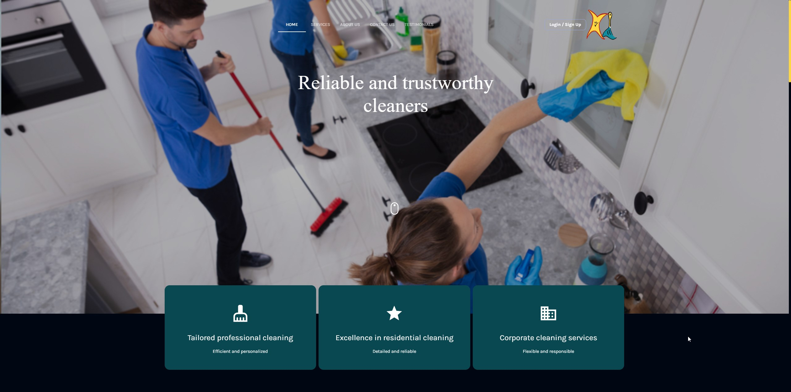

# Clean American Houses

"Clean American Houses" is a web project designed for an urban cleaning company in the United States, focused on cleaning houses and apartments. The web platform presents the company and its services in an interactive and accessible way. With sections dedicated to home, services, company information, contact and bookings, the website provides an intuitive and efficient user interface. Developed using React for the frontend and Laravel for the backend, the site integrates an API and a MySQL database to manage customer bookings and queries. The combination of these technologies ensures a smooth user experience and efficient management of the services offered.
For a more detailed view of the website and its content, I suggest you visit [Clean American Houses](https://mycleanamericanhouses.com/).

## Main Functions

- Company presentation
- Home, service, about, contact, and reservation sections.

## Development Technologies

- Frontend developed with React
- Backend developed with Laravel
- Database with MySQL.

## Additional Features

- Intuitive user interface
- Online booking system
- Detailed information on services offered.

## Screenshots

